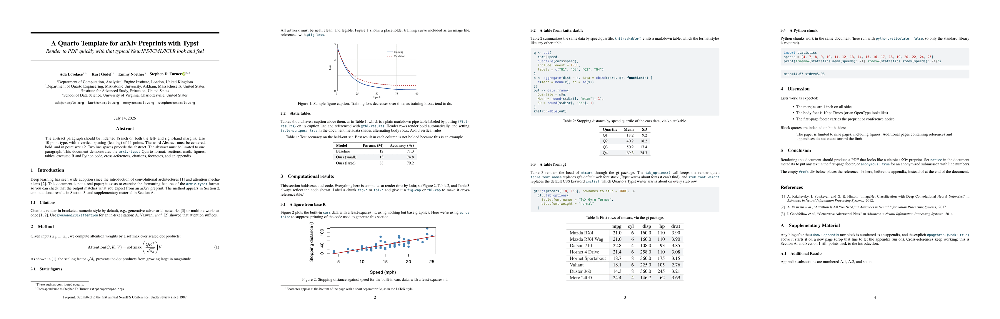

# A Quarto Template for arXiv Preprints

A Quarto extension that renders documents to PDF in the classic arXiv preprint style: the single-column ML-paper look originated by the NeurIPS style files and shared by related conferences (ICML, ICLR, and others). It uses Quarto's Typst engine (no LaTeX installation required) and adapts the NeurIPS Typst template from [daskol/typst-templates](https://github.com/daskol/typst-templates) (MIT). 

Example rendered PDF: [template.pdf](./template.pdf).



## Installation

To start a new paper from the bundled template:

```bash
quarto use template stephenturner/quarto-arxiv-typst
```

To add the format to an existing project:

```bash
quarto add stephenturner/quarto-arxiv-typst
```

Either command installs the extension into your project's `_extensions/` directory; commit that directory so collaborators render without installing anything. You can also skip GitHub entirely and copy `_extensions/arxiv` into your project by hand.

## Features

- Classic preprint page layout: title between rules, authors with superscript affiliation numbers, indented bold-labeled abstract, numbered sections, 10 pt Times-style body (bundled TeX Gyre Termes, identical output on every machine), 1-inch margins on US Letter
- Author metadata: multiple affiliations per author (superscripts sorted numerically), linked ORCID iD badges, equal-contributor and corresponding-author marks with matching first-page footnotes
- Configurable first-page footer notice, anonymous submission mode with line numbering, and a `hide-emails` option for the author block
- Numeric bracketed citations via the bundled `natbib.csl`, with "References" set at 9 pt and placeable anywhere with a `::: {#refs}` div (e.g. before the appendix)
- Quarto cross-references for sections, figures, tables, and equations, including into the appendix, numbered A, A.1, ...
- Executed R and Python code chunks through knitr, with figures, `knitr::kable()` and gt tables styled to match the paper
- Booktabs-style tables for plain markdown pipe tables, plus `toprule`/`midrule`/`botrule` helpers for raw Typst tables

## Usage

Set the format in your document header and render:

```yaml
---
title: "My Paper"
author:
  - name: Ada Lovelace
    email: ada@example.org
    affiliations:
      - id: aei
        name: Analytical Engine Institute
        department: Department of Computation
        city: London
        country: United Kingdom
abstract: |
  One paragraph, at most.
keywords: [machine learning]
bibliography: references.bib
format:
  arxiv-typst: default
---
```

```bash
quarto render paper.qmd --to arxiv-typst
```

Authors sharing an affiliation should reference it by id; give the full affiliation once and use `- id: aei` alone in later authors.

Three more author fields are supported. `orcid: 0000-0001-9140-9028` puts a linked ORCID iD badge after the author's name. `equal-contributor: true` marks each flagged author with a superscript asterisk; `corresponding: true` marks the author with a superscript dagger. Both add matching symbol footnotes at the bottom of the first page, above the notice line, like LaTeX's `\thanks`: "*These authors contributed equally." and "†Correspondence to Jane Doe \<jd4x@virginia.edu\>." The correspondence note always pairs the name with the address, since institutional usernames often identify nobody on their own, and it stays visible under `hide-emails: true`. Regular document footnotes still number from 1. The footnotes only appear when at least one author carries a flag, and all of it disappears in anonymous mode along with everything else identifying:

```yaml
  - name: Ada Lovelace
    email: ada@example.org
    equal-contributor: true
    affiliations:
      - id: aei
  - name: Stephen D. Turner
    email: stephen@example.org
    orcid: 0000-0001-9140-9028
    corresponding: true
    affiliations:
      - id: uva
```

## Format options

Set these at the top level of the document metadata.

| Option      | Default | Effect |
|-------------|---------|--------|
| `notice: "..."`   | "Preprint. Under review." | Text of the first-page footer notice. |
| `anonymous: true` | off | Submission mode: authors replaced with "Anonymous Author(s)", line numbers on. |
| `lineno: true`    | off | Force line numbers on in any mode. |
| `hide-emails: true` | off | Omit the email line under the author block. The correspondence footnote still shows the corresponding author's name and email; omit `email:` from an author's entry to keep their address off the page entirely. |
| `mainfont: "..."` | TeX Gyre Termes | Override the body font family. |

Standard [Quarto Typst options](https://quarto.org/docs/reference/formats/typst.html) also pass through: `papersize` (default `us-letter`), `margin` (default `x: 1in, y: 1in`), `section-numbering` (default `"1.1"`), and `toc` / `toc-title` / `toc-depth` (toc off by default), plus execution and figure options (`echo`, `fig-width`, ...) and `keep-typ` for debugging. Set them under the format key:

```yaml
format:
  arxiv-typst:
    echo: true
    papersize: us-letter
    margin:
      x: 1in
      y: 1in
    section-numbering: "1.1"
    toc: false
```

The body font is TeX Gyre Termes, a free OpenType Times; the extension bundles it (in `_extensions/arxiv/fonts/`, wired up through the `font-paths` option), so output is identical on every machine and Typst emits no font warnings. Set `mainfont` to use a different family.

R packages that emit their own font stacks can still trigger warnings. gt tables need two options: `table.font.names` replaces gt's web font stack (Typst warns about each font it can't find), and, if the table has a stub, `stub.font.weight` replaces gt's default CSS keyword `initial`, which Quarto's Typst writer flags as an invalid font weight on every stub row:

```r
gt::gt(head(mtcars), rownames_to_stub = TRUE) |>
  gt::tab_options(
    table.font.names = "TeX Gyre Termes",
    stub.font.weight = "normal"
  )
```

References use the bundled `natbib.csl` (bracketed numeric citations, the default in the NeurIPS style this template descends from). Override by setting `bibliographystyle` in your document metadata to any CSL file or built-in Typst style.

The reference list renders at the end of the document by default. To place it elsewhere, put an empty div with id `refs` where you want it; the usual reason is putting references before an appendix:

```markdown
::: {#refs}
:::
```

## Appendices

Everything after a raw Typst block containing `#show: appendix` is numbered A, A.1, B, and so on. Put the `#refs` div before it so the reference list stays with the main body, and include `#pagebreak(weak: true)` in the raw block if you want the appendix to start on a new page:

````markdown
::: {#refs}
:::

```{=typst}
#pagebreak(weak: true)
#show: appendix
```

# Supplementary Material
````

## Typst helpers

The template exports a few helpers usable in raw Typst blocks:

- `toprule`, `midrule`, `botrule`: booktabs-style rules for `#table`
- `#paragraph[...]`: run-in bold paragraph heading
- `#url("...")`: link set in monospace

## Testing

`template.qmd` exercises sections, cross-references, math with numbered equations, static and computed figures and tables (base R graphics, `knitr::kable()`, gt), a Python chunk, footnotes, block quotes, citations, author notes, and an appendix. The format itself needs only Quarto; rendering the demo document additionally needs R with knitr and gt (the Python chunk runs with `python.reticulate: false`, so any system Python works). Render it normally and in anonymous submission mode:

```bash
quarto render template.qmd --to arxiv-typst
quarto render template.qmd --to arxiv-typst -M anonymous:true --output submission.pdf
```

## Deployment

Publishing the extension is just pushing this repository to GitHub; there is no registry, build step, or release artifact. The layout is what makes the `quarto` commands work:

- `_extensions/arxiv/` is the extension itself: `_extension.yml`, the three template partials, `natbib.csl`, and the bundled fonts. The format id `arxiv-typst` comes from this directory's name plus the base format, so the repository can be named anything (here, `quarto-arxiv-typst`); renaming the directory renames the format.
- `template.qmd`, `references.bib`, and `loss-curve.svg` at the root are the starter files that `quarto use template` copies into a new paper. `quarto add` installs only `_extensions/`.

To release a new version, bump `version` in `_extensions/arxiv/_extension.yml` and push. Users pick up changes with `quarto update stephenturner/quarto-arxiv-typst` (and can remove with `quarto remove`). For reproducible installs, tag releases and reference them explicitly, e.g. `quarto add stephenturner/quarto-arxiv-typst@v0.1.0`.

## Scope

This format works well for arXiv preprints and for drafting papers aimed at NeurIPS or related conferences (ICML, ICLR, and others that share the look). For an actual conference submission, check the venue's current author instructions; official style files are LaTeX and pixel-exact compliance is not guaranteed here.
