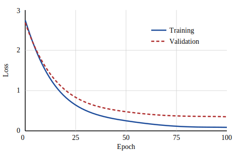

# Introduction {#sec-intro}

Deep learning has seen wide adoption since the introduction of convolutional architectures [@krizhevsky2012imagenet] and attention mechanisms [@vaswani2017attention]. This document is not a real paper; it exists to exercise the formatting features of the `arxiv-typst` format so you can check that the output matches what you expect from an arXiv preprint. The method appears in @sec-method, computational results in @sec-experiments, and supplementary material in @sec-supplement.

## Citations

Citations render in bracketed numeric style by default, e.g., generative adversarial networks [@goodfellow2014gan] or multiple works at once [@krizhevsky2012imagenet; @vaswani2017attention]. Use `@vaswani2017attention` for an in-text citation: @vaswani2017attention showed that attention suffices.

# Method {#sec-method}

Given inputs $x_1, \ldots, x_n$, we compute attention weights by a softmax over scaled dot products:

$$
\mathrm{Attention}(Q, K, V) = \mathrm{softmax}\left(\frac{QK^\top}{\sqrt{d_k}}\right)V
$$ {#eq-attn}

As shown in @eq-attn, the scaling factor $\sqrt{d_k}$ prevents the dot products from growing large in magnitude.

## Static figures {#sec-figures}

All artwork must be neat, clean, and legible. @fig-loss shows a placeholder training curve included as an image file, referenced with `@fig-loss`.

{#fig-loss width="50%"}

## Static tables {#sec-tables}

Tables should have a caption above them, as in @tbl-results, which is a plain markdown pipe table labeled by putting `{#tbl-results}` on its caption line and referenced with `@tbl-results`. Header rows render bold automatically, and setting `table-stripes: true` in the document metadata shades alternating body rows. Avoid vertical rules.

| Model       | Params (M) | Accuracy (%) |
|:------------|-----------:|-------------:|
| Baseline    |         12 |         71.3 |
| Ours (small)|         13 |         74.8 |
| Ours (large)|         88 |         79.2 |

: Test accuracy on the held-out set. Best result in each column is not bolded because this is an example. {#tbl-results}

# Computational results {#sec-experiments}

This section holds executed code. Everything here is computed at render time by knitr, so @fig-cars, @tbl-kable, and @tbl-gt always reflect the code shown. Label a chunk `fig-*` or `tbl-*` and give it a `fig-cap` or `tbl-cap` to make it cross-referenceable.^[Footnotes appear at the bottom of the page with a short separator rule, as in the LaTeX style.]

## A figure from base R

@fig-cars plots the built-in `cars` data with a least-squares fit, using nothing but base graphics. Here we're using `echo: false` to suppress printing of the code used to generate this section.

```{r}
#| label: fig-cars
#| fig-cap: "Stopping distance against speed for the built-in cars data, with a least-squares fit."
#| fig-width: 5
#| fig-height: 2.5
#| out-width: "70%"
#| echo: false
par(mar = c(4, 4, 1, 1))
plot(
  cars,
  pch = 19,
  col = "steelblue",
  xlab = "Speed (mph)",
  ylab = "Stopping distance (ft)"
)
abline(lm(dist ~ speed, data = cars), lwd = 2, col = "firebrick")
```

## A table from knitr::kable

@tbl-kable summarizes the same data by speed quartile. `knitr::kable()` emits a markdown table, which the format styles like any other table.

```{r}
#| label: tbl-kable
#| tbl-cap: "Stopping distance by speed quartile of the cars data, via knitr::kable."
q <- cut(
  cars$speed,
  quantile(cars$speed),
  include.lowest = TRUE,
  labels = c("Q1", "Q2", "Q3", "Q4")
)
s <- aggregate(dist ~ q, data = cbind(cars, q), function(x) {
  c(mean = mean(x), sd = sd(x))
})
out <- data.frame(
  Quartile = s$q,
  Mean = round(s$dist[, "mean"], 1),
  SD = round(s$dist[, "sd"], 1)
)
knitr::kable(out)
```

## A table from gt

@tbl-gt renders the head of `mtcars` through the gt package. The `tab_options()` call keeps the render quiet: `table.font.names` replaces gt's default web font stack (Typst warns about fonts it can't find), and `stub.font.weight` replaces the default CSS keyword `initial`, which Quarto's Typst writer warns about on every stub row.

```{r}
#| label: tbl-gt
#| tbl-cap: "First rows of mtcars, via the gt package."
gt::gt(head(mtcars[, 1:5]), rownames_to_stub = TRUE) |>
  gt::tab_options(
    table.font.names = "TeX Gyre Termes",
    stub.font.weight = "normal"
  )
```

## A Python chunk

Python chunks work in the same document (here run with `python.reticulate: false`, so only the standard library is required).

```{python}
#| label: py-stats
#| python.reticulate: false
import statistics
speeds = [4, 7, 8, 9, 10, 11, 12, 13, 14, 15, 16, 17, 18, 19, 20, 22, 24, 25]
print(f"mean={statistics.mean(speeds):.2f} stdev={statistics.stdev(speeds):.2f}")
```

# Discussion

Lists work as expected:

- The margins are 1 inch on all sides.
- The body font is 10 pt Times (or an OpenType lookalike).
- The first-page footer carries the preprint or conference notice.

Block quotes are indented on both sides:

> The paper is limited to nine pages, including figures. Additional pages containing references and appendices do not count toward the limit.

# Conclusion

Rendering this document should produce a PDF that looks like a classic arXiv preprint. Set `notice` in the document metadata to put any text in the first-page footer, or `anonymous: true` for an anonymized submission with line numbers.

The empty `#refs` div below places the reference list here, before the appendix, instead of at the end of the document.

::: {#refs}
:::

::: {.content-visible when-format="typst"}
```{=typst}
#pagebreak(weak: true)
#show: appendix
```
:::

# Supplementary Material {#sec-supplement}

Anything after the `#show: appendix` raw block is numbered as an appendix, and the explicit `#pagebreak(weak: true)` above it starts it on a new page (drop that line to let the appendix run on). Cross-references keep working: this is @sec-supplement, and @sec-intro still points back to the introduction.

## Additional Results

Appendix subsections are numbered A.1, A.2, and so on.
